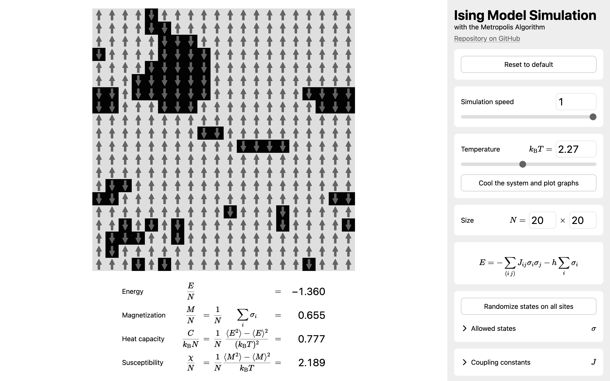
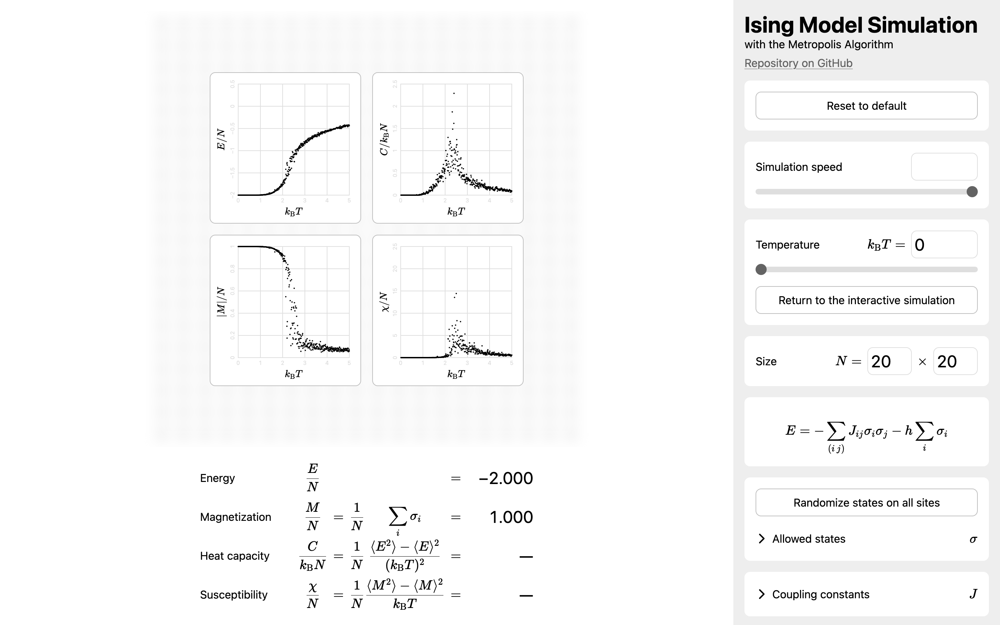

# Ising Model Simulation with the Metropolis Algorithm

[You can try it online!](https://krswm.github.io/ising)

## Features

- Visualize the spin configuration.
- Display the quantities: Energy $\frac{E}{N}$, magnetization $\frac{M}{N}$, heat capacity $\frac{C}{k_{\mathrm{B}} N}$, and susceptibility $\frac{\chi}{N}$.
- You can adjust the parameters: Temperature $k_{\mathrm{B}} T$, size $N$, allowed states $\sigma$, coupling constants $J$, and external field $h$.
- You can select the algorithms: The Metropolis algorithm and the heat bath algorithm.

- Plot the temperature dependence of the quantities.

To plot the graphs:

1. Set the temperature to start cooling from.
2. Click _Cool the system and plot graphs_.

## Examples

### External Field

1. Press _Reset to default_.
2. Adjust external field $h$.

### Antiferromagnetism

1. Press _Reset to default_.
2. Set horizontal and vertical coupling constants $J$ to −1.

### Frustration on a Triangular Lattice

1. Press _Reset to default_.
2. Set horizontal, vertical, and one of diagonal coupling constants $J$ to −1.

### One-Dimensional

1. Press _Reset to default_.
2. Set size $N$ to 20 × 1.
3. Set vertical coupling constant $J$ to 0.

### Collinear State

1. Press _Reset to default_.
2. Set horizontal, vertical coupling constants $J$ to 0.
3. Set two diagonal coupling constants $J$ to −1.

### Spin-1 Boson

1. Press _Reset to default_.
2. Add a new allowed state 0. Now we have $\sigma = 1, 0, -1$.

## Development

I learned the Ising model on a statistical mechanics lecture at university and was interested in it.
I started working on this project on November 2025.

I wrote this project in HTML, CSS, and JavaScript.

- This project formats the codes thanks to [Prettier](https://github.com/prettier/prettier).
- This project lints the codes thanks to [ESLint](https://github.com/eslint/eslint).
- The website displays mathematics thanks to [KaTeX](https://github.com/KaTeX/KaTeX).

Except for KaTeX, this project has no runtime dependencies.

This is a hobby project of mine I started from scratch.
I did not use generative AI for this project.
