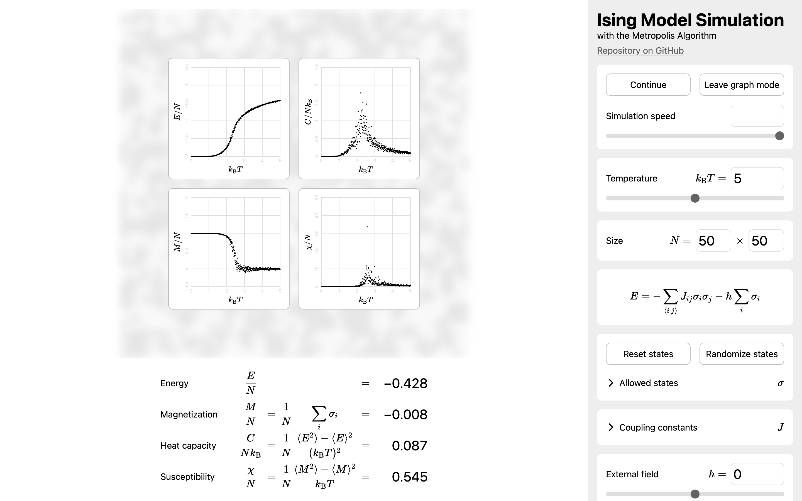

# Ising Model Simulation

This is a simulation of the Ising model, a model studied in physics to modelize magnetic materials, etc.
I wrote it in HTML+CSS+JavaScript with the Metropolis algorithm.
[You can try it online!](https://krswm.github.io/ising)

## Features

Visualize the spin configuration real-time.

Display the quantities real-time.
You can see the temperature-to-quantities graph in the *graph mode*.

- Energy $E$
- Magnetization $M$
- Heat capacity $\frac{C}{k_{\mathrm{B}}}$
- Susceptibility $\chi$

You can adjust parameters.

- Size $N$ 
- Temperature $k_{\mathrm{B}} T$
- Coupling $J$
- Field $h$

## License

[MIT License](LICENSE.txt)

## Development

I started developing this project on November 2025, after I learned and was interested on the model at the statistical mechanics class.

This is one of my hobby project I wrote from scratch.
I did not use any generative AI for this project.
